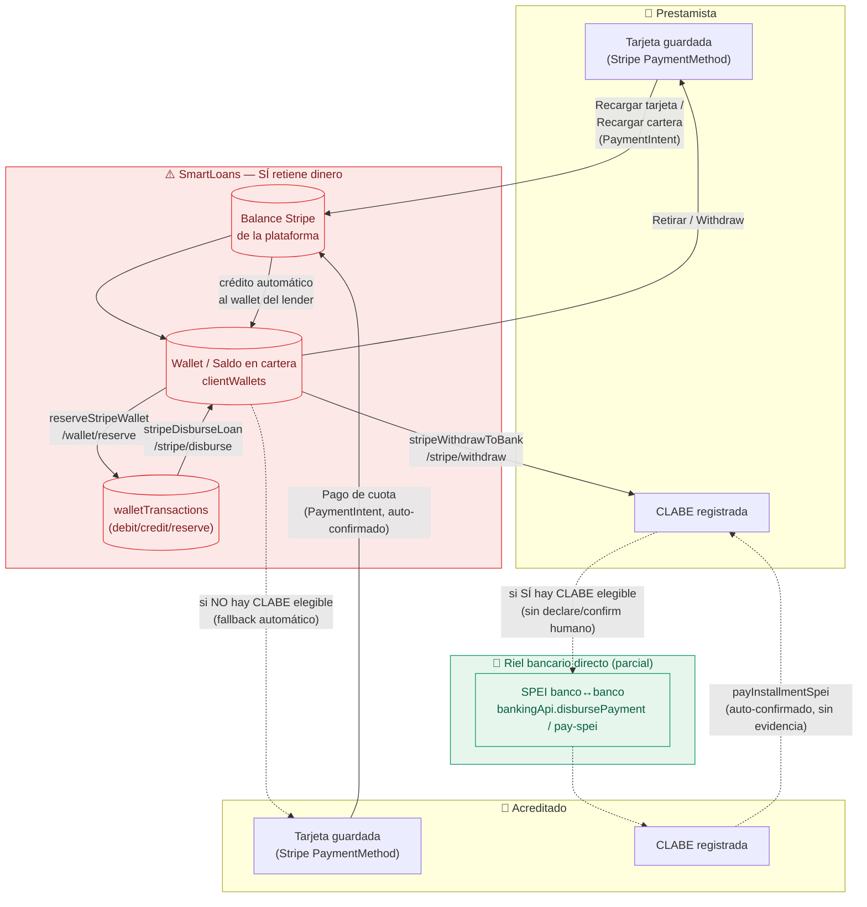

# SmartLoans — Modelo de Pagos ACTUAL (as-is, 2026-08-09)

> **Estado: análisis, no propuesta.** Este documento describe lo que el código hace
> HOY, contrastado contra la arquitectura ya congelada en
> [`p2p-direct-payments-architecture.md`](./p2p-direct-payments-architecture.md) (v1.2, 2026-08-01).
> No implementa cambios — es el punto de partida para decidir el plan de migración.
>
> ⚠️ **Parcialmente superado (2026-08-17).** El fallback Stripe/wallet dentro de
> `acceptProposal()` (§1 del diagrama, la caja roja "SmartLoans — SÍ retiene
> dinero") **fue eliminado por completo** en una sesión posterior — el fondeo de
> préstamos ya no cae a Stripe si el lender no es elegible por SPEI, es SPEI o
> nada. Además, la "contraparte backend" que §3 decía que no existía **ya
> existe y está desplegada**: `paymentIntents`/`fundingTransactions`/
> `transferEvidence` (declare→PENDING_CONFIRMATION→confirm/reject/escalate,
> exactamente lo que §4 pedía). Lo que sigue siendo cierto: nada en el frontend
> llama todavía a esos tres endpoints, y el riel de repago (§2, `mode=repayment`,
> `payInstallmentSpei`) sigue custodio/auto-confirmado sin cambios. Ver
> [`payments-workflow.md`](./payments-workflow.md) y
> [`payments-build-status.md`](./payments-build-status.md) para el estado
> verificado más reciente.

---

## 0. Resumen

El frontend actual es un **sistema híbrido custodio/no-custodio**, no el modelo
no-custodio que quedó congelado en v1.2. Conviven dos rieles:

1. Un riel SPEI/CLABE parcial (`bankingApi.ts`) — el que sí se alinea con el
   diseño objetivo, pero incompleto (sin declare→confirm, confirma solo).
2. Un riel Stripe **custodio en paralelo** — SmartLoans recibe, retiene y mueve
   dinero desde/hacia una wallet propia. Este riel es el que D1 y D2 del
   documento congelado dicen que debía retirarse.

La UI de "saldo en cartera" que el documento pide retirar sigue siendo
protagonista en varias pantallas.

---

## 1. Diagrama — flujo de dinero HOY



**Lectura del diagrama:** las cajas rojas son las que el documento congelado
prohíbe (D1: "SmartLoans nunca recibe, guarda, transfiere ni custodia dinero").
Las líneas punteadas son el riel SPEI directo que sí existe, pero que hoy es
automático (sin declare→confirm humano, D5) y es solo el **fallback** cuando
el riel Stripe custodio falla — debería ser al revés.

---

## 2. Inventario por pantalla/archivo

| Pantalla / archivo | Qué hace hoy | Riel | Cumple v1.2? |
|---|---|---|---|
| [`P2PLendingPage.tsx`](../src/pages/loans/P2PLendingPage.tsx) — `acceptProposal()` | Intenta `disbursePayment` (SPEI); si el prestamista no es elegible, reserva y mueve dinero vía Stripe wallet (`/wallet/reserve`, `/wallet/debit`, `/wallet/credit`, `/stripe/disburse`) | Híbrido, Stripe como fallback silencioso | ❌ (D1, D2) |
| `P2PLendingPage.tsx` — tile "Recargar tarjeta" (`goTopUp`) | Empuja a `/payment?mode=top_up` — recarga la wallet de SmartLoans con tarjeta | Custodio | ❌ (D1) |
| `P2PLendingPage.tsx` — tiles "Saldo en cartera" | Muestra saldo custodio como si fuera cuenta bancaria propia | Custodio (UI) | ❌ (doc §6: "se retira UI de billetera") |
| `P2PLendingPage.tsx` — `handleWithdraw()` | SPEI si elegible, si no `stripeWithdrawToBank` (`/stripe/withdraw`) | Híbrido | ❌ (D1) |
| [`LoanPaymentPage.tsx`](../src/pages/loans/LoanPaymentPage.tsx) — `mode=top_up` | Título literal **"Recargar cartera"**; cobra tarjeta vía Stripe PaymentIntent, acredita wallet | Custodio 100% | ❌ (D1, D2) |
| `LoanPaymentPage.tsx` — `mode=repayment` | Cobra la tarjeta del acreditado vía Stripe, acredita el wallet del prestamista server-side | Custodio 100% | ❌ (D1) — el acreditado nunca debería pagarle a SmartLoans |
| [`LoanDetailPage.tsx`](../src/pages/loans/LoanDetailPage.tsx) — `payInstallmentSpei()` | Debita/acredita el ledger SPEI automáticamente, sin evidencia ni confirmación humana | No-custodio, pero auto-confirma | ❌ (D5: "jamás confirma dinero automáticamente") |
| [`ClientDashboardPage.tsx`](../src/pages/clients/ClientDashboardPage.tsx) | Muestra "Saldo en billetera", botón de retiro, historial Stripe; modal "Realizar Pago" que crea un PaymentIntent suelto (sin loan/installment) | Custodio | ❌ (D1) |
| [`bankingApi.ts`](../src/api/bankingApi.ts) | `linkBankAccount`, `ledgerBalance`, `disbursePayment` — es el riel más alineado con el diseño objetivo | No-custodio (parcial) | 🟡 falta declare/confirm (D13, D14, D16) |
| [`installmentsApi.ts`](../src/api/installmentsApi.ts) | `/automated-payments/pay-spei` — mismo problema: instantáneo, sin declarar/confirmar | No-custodio, pero auto-confirma | ❌ (D5) |

---

## 3. Endpoints Stripe custodios detectados

Estos endpoints implican que SmartLoans mantiene un balance Stripe propio y lo
mueve — es exactamente el perímetro de captación que D1 busca evitar:

```
/wallet
/wallet/reserve
/wallet/release
/wallet/debit
/wallet/credit
/stripe/withdraw
/stripe/disburse
/stripe/payment-intents          (paymentType: 'wallet_top_up')
/stripe/payment-intents/confirm
```

Ninguno de los endpoints objetivo del documento congelado
(`/funding/declare`, `/funding/confirm`, `/payments/declare`,
`/payments/confirm`) existe todavía en el frontend ni parece tener contraparte
backend.

---

## 4. Piezas reusables para la migración

No hay que empezar de cero — esto ya existe y está alineado con el modelo objetivo:

- `bankingApi.ts` — link de CLABE, `ledgerBalance`, `disbursePayment`.
- El componente de vinculación de CLABE (`BankAccountLink`) y el gating
  `hasVerifiedAccount` en `P2PLendingPage.tsx`.

Lo que falta para llegar a v1.2: el split `declare → PENDING_CONFIRMATION →
confirm/reject/escalate` (D5, D13, D14, D16) tanto en `disbursePayment` como en
`payInstallmentSpei`, y remover por completo el riel `wallet/*` y
`stripe/disburse|withdraw|payment-intents` + la UI de "Recargar cartera" /
"Saldo en cartera".

---

## 5. Nota

`docs/payment-banking-first-redesign.md` (2026-07-30) ya documentaba el riel
Stripe como "fallback temporal mientras se valida SPEI" — la intención
original no era que quedara como wallet recargable a discreción del usuario.
Ese es el mejor indicio de por qué el código custodio sigue ahí: fue una fase
de transición que nunca se completó hacia el modelo v1.2.
