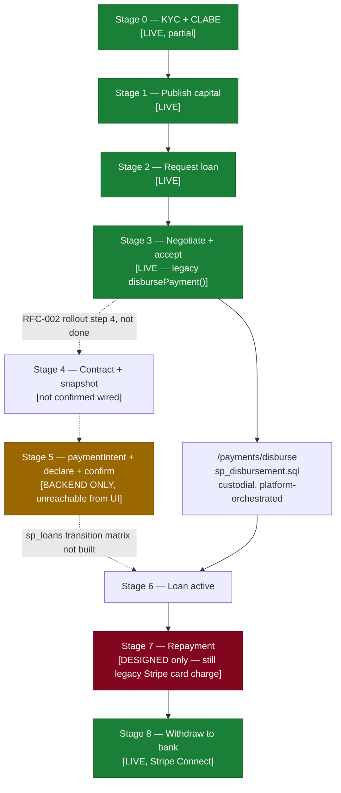

# SmartLoans — Payments Workflow (End-to-End)

> **Scope:** the SmartLoans peer-to-peer lending money flow, from a lender declaring
> capital through to loan repayment. Not the POS GMO vending/cart checkout.
>
> **This document is a map, not a spec.** For the frozen domain design see
> [`p2p-direct-payments-architecture.md`](./p2p-direct-payments-architecture.md) (v1.2)
> and [`docs/rfcs/`](./rfcs/) (RFC-001/002/003, all **APROBADO**). For exact state
> machines see [`payment-domain-state-machines.md`](./payment-domain-state-machines.md).
> For what's actually deployed today — verified, not assumed — see
> [`payments-build-status.md`](./payments-build-status.md), generated the same day as
> this file (2026-08-17) by reading the live `main` branch of both repos and the
> production `main.py` router list, not by trusting prior descriptions.
>
> **Golden rule (D5):** the system never confirms money automatically. A human
> confirms, or support resolves an escalation. Nothing here calls a "send money"
> API on SmartLoans' behalf for lender↔borrower transfers — every leg is SPEI the
> user sends from their own bank, which SmartLoans only records.

---

## 1. Actors

| Actor | Sends money via | Receives money via | Frontend home |
|---|---|---|---|
| **Lender** | Direct SPEI, own bank → borrower's CLABE | SPEI from borrower (repayments); own bank | `/lender-dashboard/:clientId`, `/p2p-lending` |
| **Borrower** | Direct SPEI, own bank → lender's CLABE (repayments) | SPEI from lender (funding) | `/client-dashboard/:clientId` |
| **SmartLoans** | *never* — non-custodial by design (D1) | Stripe, card-only, for the connection/platform fee only (D10) | — |

SmartLoans' role in every money-moving step below is identical: **record the
expectation (`paymentIntent`), record the declaration, record the confirmation.**
It never touches STP's send-money API and never debits/credits a wallet balance
to represent real money for loan funding or loan repayment.

---

## 2. The full lifecycle, stage by stage

Each stage is tagged **[LIVE]** (built + deployed + reachable from the UI),
**[BACKEND ONLY]** (built + deployed, nothing in the UI calls it yet), or
**[DESIGNED]** (approved in an RFC, no code yet). See
[payments-build-status.md](./payments-build-status.md) for the verification behind
every tag.

### Stage 0 — KYC + CLABE registration `[LIVE, partial]`
Expediente Digital wizard collects identity + face + (for lenders, mandatory;
borrowers, deferred) a bank account (`bankAccounts` table). CLABE
versioning/immutability (D18: `PENDING_VERIFICATION → PRIMARY → ARCHIVED`) and
duplicate-detection via `clabeHash` are live in `sql/sp_bankAccountsLifecycle.sql`.
RFC-001's `reveal_counterparty` (audited full-CLABE reveal to a loan counterparty)
exists in that same file.

### Stage 1 — Lender publishes capital `[LIVE]`
`P2PLendingPage.tsx` → `POST /loanOffers` (action 1, cumulative — publishing
$1,000 on top of an existing $5,000 offer updates the same active row to
$6,000, it does not replace it). Requires the `offerAgreeVirtual` consent
checkbox. On success: a ticket confirmation modal, plus email/WhatsApp receipt
(`modules/loanOffers.py:_send_offer_published_ticket`). A `CAPITAL_DECLARED`
entry is posted to `walletTransactions` — **informational ledger only** (D2),
explicitly excluded from the real-money balance projection
(`sp_walletTransactions_balance`'s `@available` calculation skips
`CAPITAL_DECLARED/CAPITAL_COMMITTED/CAPITAL_UNDECLARED` — this was a real bug
fixed this session, see build-status doc).

### Stage 2 — Borrower requests / proposes a loan `[LIVE]`
`POST /loanProposals` → matched lenders get a push
(`modules/loans.py:_notify_matching_lenders`, MVP wallet-balance matching via
`sp_loans_matchLenders`). Ticket confirmation shown to the borrower on submit.

### Stage 3 — Negotiation → accept `[LIVE, but see gap]`
Chat/negotiation via existing loan-chat pages. `acceptProposal()` in
`P2PLendingPage.tsx` is the pivot point RFC-002 targets for retirement (its own
§Rollout step 4: *"retiro del flujo custodio de `acceptProposal`"*) — **this has
not happened yet.** `acceptProposal()` today still calls the legacy
`disbursePayment()` → `POST /payments/disburse` (`sp_disbursement.sql`), a
platform-orchestrated transfer, not the declare/confirm flow described below.
This is the single biggest gap in the whole pipeline — see
[payments-build-status.md §5](./payments-build-status.md).

### Stage 4 — Contract signature
`digitalContracts` module generates contract + pagaré. RFC-002 says a
`paymentIntent` (type `FUNDING`) and both parties' `bankAccountSnapshots`
should be created automatically at this step. **Not confirmed wired** — the
backend endpoints exist (`POST /paymentIntents` action `create`) but nothing
in `digitalContracts`/`P2PLendingPage.tsx` calls them yet (Stage 3's gap means
this step is currently skipped entirely; funding happens the old way).

### Stage 5 — Funding: declare + confirm `[BACKEND ONLY]`
The non-custodial replacement for Stage 3's legacy disbursement, fully built
and live in the backend, unreachable from any screen today:

1. `POST /paymentIntents` `create`, `intentType: "FUNDING"` — expectation only,
   5-day `expiresAt` (D12), one **OPEN** FUNDING intent per loan enforced by a
   unique filtered index.
2. Lender sends the SPEI **themselves, from their own banking app**, outside
   SmartLoans entirely.
3. Lender declares it: `POST /fundingTransactions` `declare` — records
   `claveRastreo`-free amount/date (evidence is a separate call, see below);
   flips the linked `paymentIntent` to `DECLARED`.
4. (Should happen, same step) `POST /transferEvidence` `create` —
   `referenceType: "FUNDING"`, `claveRastreo` (unique per company),
   amount cross-checked against the `paymentIntent` within ±$1.
5. Borrower — **only the borrower** — confirms: `POST /fundingTransactions`
   `confirm`. This is the money-creates-the-loan moment.
6. No confirm/reject within `escalateAfterDays` (caller-supplied, default 2) →
   cron would call `escalate_due` → `ESCALATED` → support resolves via
   `resolve_escalation` with real evidence (CEP). **The cron itself is not
   wired** — see gap list.
7. `paymentIntent` unconfirmed past its 5-day `expiresAt` → cron would call
   `expire_due` → loan returns to marketplace. **Also not wired.**

### Stage 6 — Loan active
RFC-002 says `FundingTransaction.confirm()` should flip the loan
`FUNDING_PENDING → FUNDED`, and a successful `PaymentSchedule` generation then
flips it to `ACTIVE` (these are deliberately not the same instant — see
`payment-domain-state-machines.md` §2.1, footnote). **Not built**: `sp_loans`
has no `transition` action and no `pending_funding`/`funded` states yet — only
a free-text `loanStatus` defaulting to `'pending'`. This orchestration
currently lives nowhere; it's the next piece after Stage 3/5 get wired
together.

### Stage 7 — Repayment (installments) `[DESIGNED only]`
RFC-003's mirror of Stage 5 — borrower declares, lender confirms — with its
own `loanPayments` table (`paymentType ∈ {INSTALLMENT, PARTIAL, PAYOFF}`,
deliberately **not** the same table as funding, D13). **None of this is
built.** Repayment today still runs on the legacy rail: a Stripe off-session
`PaymentIntent` charges the borrower's saved card
(`modules/automatedPayments.py:charge_due_installments`, cron'd daily at 07:00
UTC in `main.py`), landing in the platform's Stripe balance, with a SQL row
crediting the lender's `walletTransactions` ledger. This is real custodial
money movement for repayments, still live in production, not yet migrated.

### Stage 8 — Withdraw to bank
Existing Stripe Connect payout (`POST /stripe/withdraw`) — outside the scope
of RFC-002/003, which only cover funding and repayment declarations, not
payouts of a Stripe balance that (per Stage 7) still exists for repayments.

---

## 3. Diagram

The bottom branch (`D → J → G`) is what a real loan takes **today**. The top
branch (`E → F → G`) is what RFC-002 specifies and the backend already
supports, but nothing routes traffic through it yet.

---

## 4. State machines — quick reference

Full diagrams live in [payment-domain-state-machines.md](./payment-domain-state-machines.md).
Summary of what's actually enforced by the deployed `sp_fundingTransactions`:

| Transition | Actor | Enforced today? |
|---|---|---|
| `PENDING_CONFIRMATION → CONFIRMED` | borrower only (`confirmedByClientId` must equal `borrowerClientId`) | ✅ SP-level check |
| `PENDING_CONFIRMATION → REJECTED` | borrower only | ✅ SP-level check |
| `PENDING_CONFIRMATION → ESCALATED` | cron (`escalate_due`) | ✅ action exists, ❌ no cron calls it |
| `ESCALATED → CONFIRMED \| CANCELLED` | support/admin (`resolve_escalation`) | ✅ action exists, no role check in the SP itself — authorization is expected to be enforced by whatever calls it (not yet built) |
| `OPEN → EXPIRED` (paymentIntents) | cron (`expire_due`) | ✅ action exists, ❌ no cron calls it |

---

## 5. What's live vs. gap — short version

- **Solid and live end-to-end**: capital publishing (cumulative, consent,
  ticket, email/WhatsApp), loan proposal + ticket, CLABE registration/versioning.
- **Backend fully built, zero frontend wiring**: `paymentIntents`,
  `fundingTransactions`, `transferEvidence` — confirmed live in production
  (`main.py` on `main` registers all three routers; see build-status doc for
  the live `curl`/SQL verification). `grep` across `src/api/` and `src/pages/`
  in this repo finds **no reference to any of the three** — `acceptProposal()`
  still calls the legacy `disbursePayment()`.
- **Designed only, not started**: repayment declare/confirm (`loanPayments`),
  `paymentHistory` (D16 audit trail), `sp_loans` transition matrix,
  `LoanActivated` event, both crons (`expire_due`, `escalate_due`).

Full detail, including the exact schema drift between the frozen v1.2 spec
and what was actually hand-authored: [payments-build-status.md](./payments-build-status.md).

---

## 6. Cross-references

| Document | What it's for |
|---|---|
| [p2p-direct-payments-architecture.md](./p2p-direct-payments-architecture.md) | Frozen v1.2 domain spec — decisions D1–D20, target schema, governance/RFC process |
| [payment-domain-state-machines.md](./payment-domain-state-machines.md) | Exact state diagrams + capital-ledger 4-bucket semantics |
| [rfcs/RFC-001-clabe-verification.md](./rfcs/RFC-001-clabe-verification.md) | CLABE registration/versioning design |
| [rfcs/RFC-002-funding-workflow.md](./rfcs/RFC-002-funding-workflow.md) | Funding declare/confirm design (Stage 5 above) |
| [rfcs/RFC-003-payment-intents.md](./rfcs/RFC-003-payment-intents.md) | Repayment declare/confirm design (Stage 7 above) |
| [payments-build-status.md](./payments-build-status.md) | **This session's verification**: what's actually deployed, endpoint reference, schema drift, gap list |
| [current-payment-model-as-is.md](./current-payment-model-as-is.md) (2026-08-09, Spanish) | Older hybrid-era as-is snapshot; now carries a superseded banner — the Stripe fallback it flags in `acceptProposal()` is gone, but its repayment-rail findings (§2) are still accurate |
| [smartloans-payment-process.md](./smartloans-payment-process.md) | Stripe Connect onboarding (KYC, CLABE/card attach) — orthogonal to SPEI funding, still fully applicable; its §3b (disbursement) now carries a superseded banner |
